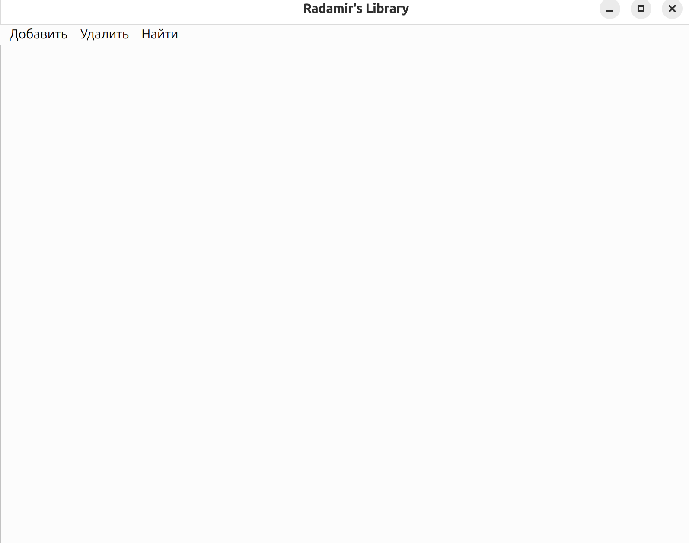
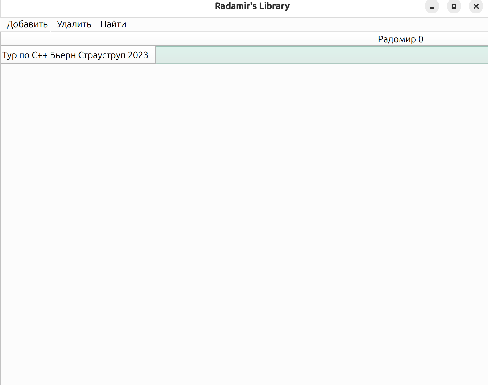

# lectureTask
Это проект Ткаченко Радомира из группы 4

Главное:

В диалогах можно нажимать на Enter для ввода

Реализованы адаптивные размеры таблицы при растягивании и сужении окна

Все ключевые функции покрыты тестами (21 тест в фреймворке Google Test)

Использованы все указанные виды умных указателей

Предусмотрены крайние случаи при удалении книг и пользователей 

Все диалоги пользовательские

Краткое описание:

Вот какое окно встречает пользователя при запуске программы

Мы видим пустую таблицу, и кнопки меню с доступными действиями

Если навести мышкой на действия, то выпадет следующий список

Добавим книгу

Теперь добавим пользователя, чтобы было понятнее

Заметим, что нам не надо вводить его id, программа сама сгенерирует уникальный номер.
Появился столбец с именем пользователя.
Пока что он занимает все пространство, так как он только один
На пересечении столбца с Именем пользователя и названием книги можно записать брал ли пользователь эту книгу.

Кроме имени пользователя в столбце написан его id

Теперь продемонстрируем, что будет если ввод неккоректный

Аналогично программа будет реагировать, если ввести в качестве года издания строку и тп.

Теперь попробуем найти пользователя

Аналогично с книгами.
Теперь удалим пользователя

С книгами аналогично.
